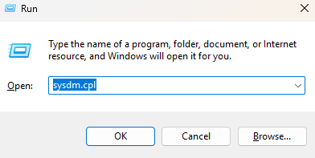
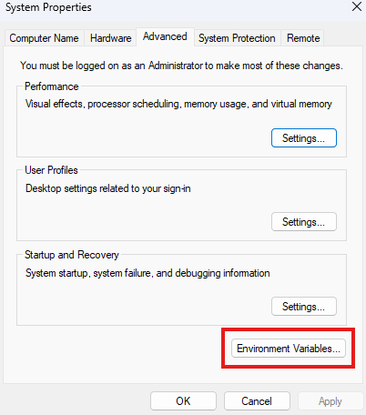
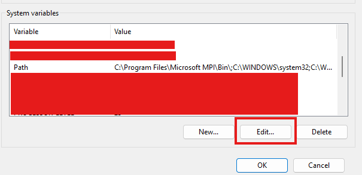
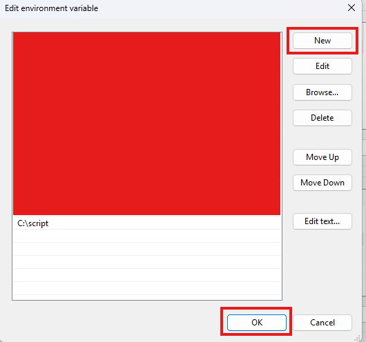
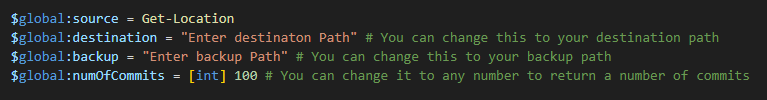

# Automated File Transfer for Offline Developers

This PowerShell script automates the process of transferring modified files detected from Git commits to a production server and backs up original files from the server before being modified. It's designed for developers who work offline and need a streamlined way to update their production environment with changes.

## Features

* **Automated File Detection:** The script automatically identifies files that have been modified since the last commit.
* **Targeted Transfer:** Only modified files are transferred to the production server, ensuring efficiency and minimizing unnecessary data transfer.
* **Offline-Friendly:**  Works seamlessly for developers working offline, eliminating the need for constant online access.
* **Server Mapping:** Supports production servers mapped to local machines for easy file transfer.
* **File Backup:** Before the files on the server gets modified, they are backed up first before proceeding to the transfer.

## Requirements

* **PowerShell:** This script requires PowerShell to be installed on your system.
* **Git:** You need Git installed and configured on your machine.
* **Production Server Mapping:** Your production server should be mapped to your local machine.

## Installation

1. **Download the Script:** Download the `transfer_files.ps1` script from this repository.
2. **Enable the Script to execute:** Change the execution policy to be able to run the script, as windows prevents this by default.

    2.1. Open powershell as an administrator

    2.2. Run this line : `Set-ExecutionPolicy Unrestricted -Scope CurrentUser`
3. **Place the Script:** Save the script in a convenient location on your machine.
    
    Example : 

    3.1 Copy the relative path where you placed the script.

    3.2. Open run `win + r`.

    
    
    3.3. Type `sysdm.cpl` to open system properties, click on the Advance tab. Under the Advance tab, click on the Environment Vairable button.

    

    3.4. Under the system variable, select "Path" and click the edit button.

    

    3.5. Click the "New" button and paste in the relative path you copied and click "OK" to accept all changes.

    

    3.6. Open the script using any editor and set the location paths and the number of commits you would like to extract.

    

    3.7. You will be able to execute the script from anywhere.

4. **Run the Script:** Open PowerShell and navigate to the directory where git is initiated. Execute the command: `transfer`.

## Usage

1. **Make Changes:**  Make your desired changes to your project files.
2. **Commit Changes:** Commit your changes to the Git repository.
3. **Set location paths** Make sure you set the location of your paths before running the script.
4. **Run the Script:** run `transfer` on powershell under the directory of your git repository to transfer the modified files to your production server.
5. **Backup:** a back up of the original code will be made under a a folder named previousChanges with the date the script was executed under the backup path location you made.

